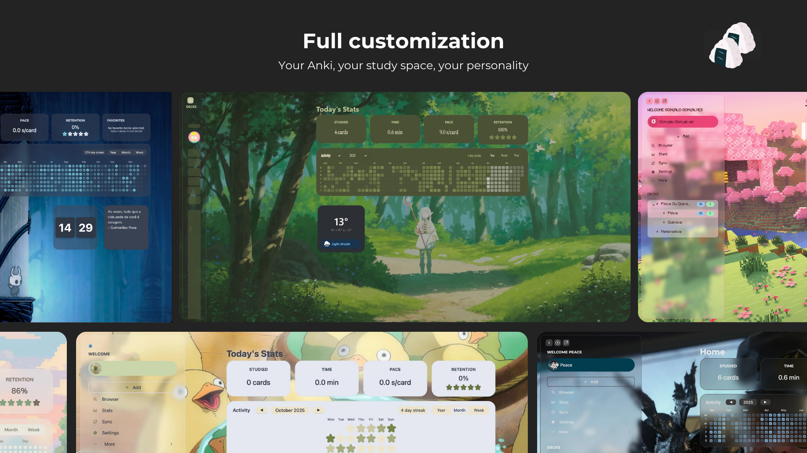
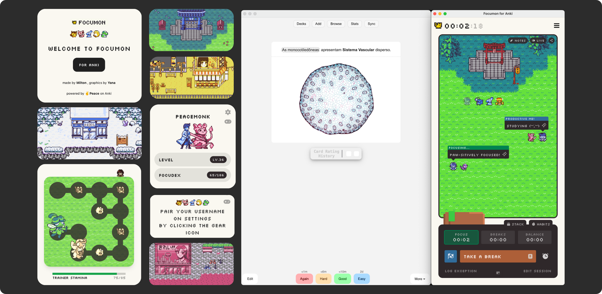

# WIP

Bagian ini ditunjukkan kepada pembaca yang mempunyai PC/Komputer, Laptop dan memiliki waktu luang untuk mengatur semua aplikasi.

Contoh setup jadi:  

  

## Yomitan Setup (Beginners)

Download Yomitan for your browser here:  
[Chrome Web Store](https://chromewebstore.google.com/detail/yomitan/likgccmbimhjbgkjambclfkhldnlhbnn)  
[Microsoft Edge Add-ons](https://microsoftedge.microsoft.com/addons/detail/yomitan-popup-dictionary/idelnfbbmikgfiejhgmddlbkfgiifnnn)  
[Firefox Add-ons](https://addons.mozilla.org/firefox/addon/yomitan/)

Upon installation, you then need to install some dictionaries. If you press `Get recommended dictionaries…`, nearly all these dictionaries listed I actually recommend for basic use. So get these:

- JMnedict
- KANJIDIC
- BCCWJ
- JPDB
- Jiten

This isn't everything you need though.

**I do NOT recommend "Jitendex"!** It's JMdict, but with a ton of HTML, CSS and hyperlinks added to the cards. **This creates friction for Anki card creation**. How do you effectively filter out superfluous information without manual labour? You can't. Use a simple version of JMdict, like the one in my collection.

In addition to the "Recommended Dictionaries" (excluding Jitendex) you can install within Yomitan by default, you should also get these additional dictionaries you can find at **[my dictionary collection](https://learnjapanese.link/dictionaries)**

Import dictionaries by clicking `Configure installed and enabled dictionaries…` then click "Import"

You can also just download everything in one go:  
[**➡Shoui method dictionary pack** (download all at once)](https://drive.google.com/drive/folders/16nPmTCQtpi43wkYdvTh7Qfngr21FE36W?usp=sharing)

- `Bilingual/[Bilingual] JMdict (English) ("Legacy")`
- `Bilingual/[Bilingual] 研究社　新和英大辞典　第５版.zip`
- `Bilingual/[Bilingual] NEW斎藤和英大辞典.zip`
- `Bilingual/[Bilingual] Babylon Japanese-English.zip`
- `Bilingual/[Bilingual, onomatopoeia] Onomatoproject.zip`
- `Kanji/[Kanji] TISMKANJI.zip`
- `Monolingual/[Monolingual] 実用日本語表現辞典 Extended (Recommended)`
- `Monolingual/[Monolingual, Encyclopedia] PixivLight.zip`
- `Grammar/[Grammar] Bunpro.zip`
- `Grammar/[Grammar] Dictionary of Japanese Grammar 日本語文法辞典.zip`
- `Grammar/[Grammar] JLPT文法解説まとめ(nihongo_kyoushi).zip`
- `Grammar/[Grammar] どんなとき使う日本語表現文型辞典.zip`
- `Grammar/[Grammar] 毎日のんびり日本語教師 (nihongosensei).zip`
- `Grammar/[Grammar] 絵でわかる日本語.zip`
- `Pitch Accent/[Pitch] アクセント辞典v2 (Recommended).zip`
- `Frequency/[Freq] CC100.zip`
- `Frequency/[Freq] Jiten (Anime).zip`
- `Frequency/[Freq] Anime & J-drama.zip`
- `Frequency/[Freq] VN Freq v2.zip`

The order you put your dicts is important, here is what I recommend for beginners:

1. Jitendex (JMdict)
2. 研究社　新和英大辞典　第５版
3. Bunpro
4. Dictionary of Japanese Grammar
5. 実用日本語表現辞典
6. (everything else can be in whatever order.)

This is good enough for a beginner.

Now change some very important Yomitan settings:

Under "Popup Behavior", ENABLE **Allow scanning popup content**. Set the **Maximum number of child popups** to `9999`

Without this, you won't be able to look up Japanese words in dictionary entries. With this enabled, the process becomes much easier, you can infinitely look up words within entries.

Another option I always enabled was automatic audio playback.  
Under "Audio", enable "**Auto-play search result audio**".

If you find it too distracting you don't need to enable it though.

Also, the default pop up size on Yomitan is stupidly tiny. Double the size here:

Width=800, Height=500.

Lastly, TURN OFF this stupid thing:

## Anki setup

The Anki card type I used for the majority of my Japanese learning journey was the [Animecards](https://animecards.site) format, but with the front modified to include both the word and the sentence.  
I switched to [Lapis](https://github.com/donkuri/lapis) eventually, as I saw it as the "saving grace" of card types for its simplicity-driven philosophy and wide compatibility with people's preexisting setups. Animecards has also since switched to Lapis as well.  
While not the card type I personally used (if you _really_ want it, that can be found here: ["Shoui card type"](https://drive.google.com/file/d/1DZYu0cJd3-2T6a1_FBwFBV98hmiTeSfl/view?usp=sharing)), I will be showing you how I personally setup Anki using the [Lapis note type](https://github.com/donkuri/lapis).

### Installation

Download Anki [here](https://apps.ankiweb.net/). Install the version for your operating system.

As of 2025, this now installs the "Anki Launcher", which achieves nothing but be more difficult to use for the average user.  
Upon installation, you will see this: 

Press Enter, and the actual Anki program will now be installed.

When complete, it should say "Anki will start shortly. You can now close this window." Close the black terminal window.  
Then, you should see a new window pop up like this:

This sets the **display language**, for the user interface of Anki. Any language you can read is fine.

Now you will see the main Anki screen. Before you do anything, I recommend you install essential addons. Do that by:

- Click on "Tools" to open the tools menu.
- Click on "Add-ons"
- Click "Get Add-ons.."
- Paste the _add-on code_ for the desired addon, and click OK. Do this for all add-ons in the list.

Here are the add-on codes for all essential add-ons you _must_ have.

- AnkiConnect: `2055492159`
- PassFail2: `876946123`
- AutoReorder: `757527607`
- True Retention: `613684242`
- Local Audio Server for Yomichan: `1045800357`
- Advanced Browser: `874215009`

  
 

After you have added all the add-ons, restart Anki by closing it out completely and reloading it.

The basic setup for Anki is actually now complete.

### Importing a deck

Download the [Kaishi 1.5k deck](https://github.com/donkuri/kaishi/releases). The `.apkg` file.

Load the deck into Anki by double clicking on the `.apkg` file. Alternatively you can load it using "Import File" in Anki and selecting the file manually.

Then, you should see this, import it by clicking **Import**:

After that, you can close the import window.

The deck is now imported. Now you need to adjust the _deck settings_. This will be explained in **Global deck settings**, because it applies to all decks as well.

### Global deck settings

Once you have a deck imported, click on the cog/gear icon then click "Options" 

Adjust the settings as follows:

- Maximum reviews/day: `9999`
- Learning steps: `1m 5m 10m`
- New/review order: `Show after reviews`
- FSRS: ON
- Desired retention: any value between `80%` - `95%`

*The desired retention I used personally was **95%**, if you really want to copy me, use that, at your own discretion, but I think that might be too much for most people. 80%-90% is best for most. FSRS didn't exist for the majority of my JP learning journey, but I think it's marginally better than the stock Anki algorithm.  
Additionally, you should consider reoptimizing FSRS parameters every now and then.  
 

You are now ready to learn with Kaishi, and any other deck.

### Mining setup w/ Lapis (shoui method)
Here's how to mine with my setup.

PREREQUISITES:

- Yomitan
- AnkiConnect addon installed in Anki.
- I'm assuming you've imported the [dictionaries I recommended](https://learnjapanese.moe/shouimethod/#yomitan-setup-beginners) in this guide.

Then:

1. Download Lapis [here](https://github.com/donkuri/lapis/releases/download/v1.6.0/Lapis.apkg)
2. Import it into Anki, then after you import that apkg, delete the deck it leaves behind. We only need the note type.
3. In Anki, click "Create Deck" on the bottom. Give your deck a name (e.g. `Mining` and press OK)
4. Open the Yomitan settings by clicking the Yomitan icon  in your browser toolbar, then the  cog icon.
5. Click on "**Anki**" in the sidebar, then ENABLE **Enable Anki integration**.
6. Then click **Configure Anki flashcards…**
7. Change "Deck" to the name of your deck you just created (e.g. `Mining`). Change the "Model" to `Lapis`.

Now configure the card fields:

| Field                     | Value                                                                        |
| ------------------------- | ---------------------------------------------------------------------------- |
| Expression                | `{expression}`                                                               |
| ExpressionFurigana        | `{furigana-plain}`                                                           |
| ExpressionReading         | `{reading}`                                                                  |
| ExpressionAudio           | `{audio}`                                                                    |
| SelectionText             | `{popup-selection-text}`                                                     |
| MainDefinition [1]        | `{single-glossary-jmdict-legacy-2026-01-14}{single-glossary-研究社-新和英大辞典-第５版}` |
| DefinitionPicture         |                                                                              |
| Sentence                  | `{cloze-prefix}<b>{cloze-body}</b>{cloze-suffix}`                            |
| SentenceFurigana          |                                                                              |
| SentenceAudio             |                                                                              |
| Picture                   |                                                                              |
| Glossary                  | `{glossary}`                                                                 |
| Hint                      |                                                                              |
| IsWordAndSentenceCard [2] | y                                                                            |
| IsClickCard               |                                                                              |
| IsSentenceCard            |                                                                              |
| IsAudioCard               |                                                                              |
| PitchPosition             | `{pitch-accent-positions}`                                                   |
| PitchCategories           | `{pitch-accent-categories}`                                                  |
| Frequency                 | `{frequencies}`                                                              |
| FreqSort                  | `{frequency-harmonic-rank}`                                                  |
| MiscInfo [3]              | `{document-title}`                                                           |

[1] Ideally, put your two favourite dictionaries in here. What I've defined here (Jmdict+kenkyuusha) is just the basic list that will be fine for people that are not going monolingual yet. This is supposed to be a safety net when you are too lazy to highlight text for `SelectionText`. Ideally you would highlight your chosen definition, then press the green button to add a card, but I understand, that is actually a lot of work. So `MainDefinition` is your safety net. Your next safety net/fallback is `Glossary`, which contains everything in the Yomitan pop up when you added the card. Lapis is intelligent and can fallback to the relevant field if one is blank. (E.g., if `SelectionText` is blank, it will fallback to `MainDefinition`. If `MainDefinition` is blank, it will fallback to `Glossary`).

Also, warning: the JMdict name contains the date the dict was built, if you downloaded it from my drive, it should be `{single-glossary-jmdict-legacy-2026-01-14}`, if you got it directly from [the source](https://github.com/yomidevs/jmdict-yomitan), the date will be different, so adjust accordingly.

[2] In my method, I put both the sentence and the word on the front. But I rarely ever read the sentence, it was just there for visual context. Depending on who you are, (if youre the type to use that sentence as a crutch, then remove the `y` please.), you might find this useful or you might find it to be shooting yourself in the foot. Personally, I liked having it, as it was more reflective of real world use without being tiresome and too easy at the same time like sentence cards.

[3] I put this to {document-title} because I mainly mined from novels when reading from ッツ, so this would be adding the name of the book as embedded information in the card that you can access later.

Now, all you need to do to mine a card, is hover over a word, hold Shift to show Yomitan, then press the green button. Test it with this: テスト. Use the green button to add the card. Press the book icon to open the Anki browser to the card.

Ideally, you should highlight the definition you want on the back, _before_ pressing the green button. This makes your cards look really clean. 　

Try that out with this word: この世 　

Use your mouse to highlight the first line of the 研究社　新和英大辞典　第５版　definition, then press the green button. Press the book icon, then "Preview" in Anki to see how the card looks. Compare it to the previous card you added. The one where you highlighted the definition you wanted looks cleaner. If you want to refer to the full information when reviewing, Lapis lets you see that by clicking on the left and right edges of the box the definition is shown in.

My mining philosophy is to **mine everything**. I don't worry about what I mine. I also make sure to put as minimal effort into my mining process as possible. This means the majority of my cards are made by just clicking the green button or highlighting then clicking the green button.

Also, if the word you are mining is a noun or a very descriptive adjective, then you should search the word on Google Images, copy an image and put that in the "Picture" field of your card. This is the most manual intervention you need to do for your cards. I genuinely think having a picture on the back of the card when it's a noun is a night-and-day difference, so it's worth the effort.

If your Google keeps defaulting to Chinese results, it's because your Google is not set to Japanese yet. You can fix this Chinese results issue by either:

- setting your Google language to Japanese
- appending とは to all kanji-only searches
- Using this Google JP Only tampermonkey script I made. [Link](https://learnjapanese.moe/google_jp_only.js)

### FREQUENCY SORTING (EASY!)

This sorts the order your mined cards are shown to you based on how common they are in Japanese.

Why frequency sorting is good: because you will learn the most important words first in your deck.

It's really easy, assuming you already have frequency information on your cards. (If you have `{frequency-harmonic-rank}` for FreqSort, you already have frequency on your cards)

PREREQUISITES:

- AutoReorder add-on for Anki, code: `757527607`
- I'm assuming you're using Lapis, and I am assuming you already have frequency information on your cards.

After you installed the AutoReorder Anki-addon, reload Anki. Then:

1. Go to `Tools` → `Add-ons` then double click `AutoReorder`
2. In this text editor window, carefully change the deck enclosed in quotes name after `search_to_sort:` to the name of your deck. Also carefully change the field name after `sort_field:` to `"FreqSort"` (enclosed in quotes.)
3. Press OK, then restart Anki. Your cards will automatically be repositioned based on how common they are, every time you launch Anki.

Example text for people who are confused. If your deck name is "Mining", and you're using Lapis. Here's what it should look like:

`{     "search_to_sort": "deck:Mining is:new",     "shift_existing": true,     "sort_field": "FreqSort",     "sort_reverse": false }`

Caution, if your deck name _has spaces_, you would need to do something called "escaping" the spaces. E.g. if your deck name was "Mining Deck", you would need to do this:

`{     "search_to_sort": "\"deck:Mining Deck\" is:new",     "shift_existing": true,     "sort_field": "FreqSort",     "sort_reverse": false }`

That's... it. You are done! Feel free to just normally mine cards as you usually would. They will be automatically reordered every time you launch Anki.

#### FREQUENCY BACKFILLING

Do this if you have already mined a ton of cards that do not have frequency info.  
[Follow this.](https://github.com/MarvNC/JP-Resources?tab=readme-ov-file#backfilling-old-cards)

### LOCAL AUDIO (EASY!)

Why local audio is good: Because it has more audio than available by default in Yomitan. Because the sources used in the local audio have accurate pitch accent. Because it's fully available offline.

Tedious to set up, but very important imo.  
I'll try to make it as simple as possible to understand.

FIRST, you need to download a big file. Officially this is a .torrent, but I think that's too user unfriendly. So I uploaded it as a direct download.

➡[DOWNLOAD LOCAL AUDIO .tar.xz HERE](https://mega.nz/file/dRElUKCR#xvnd132dOmowzMls6LBqT8Rq5pmARWwVrrs2XuiZJFU)

You need the local audio server Anki add-on, code here: `1045800357`.  
Install this Anki add-on (`Tools` → `Add-ons` → `Get Add-ons...` → paste code → `OK`) and restart Anki.

You also need [7-Zip](https://www.7-zip.org/) or [NanaZip](https://apps.microsoft.com/detail/9n8g7tscl18r) (if on Windows 11) if you don't have it already.

Also, I recommend putting the local audio .tar.xz file on an SSD, not a mechanical spinning hard drive.

### STEPS BELOW

[DOWNLOAD LOCAL AUDIO .tar.xz HERE](https://mega.nz/file/dRElUKCR#xvnd132dOmowzMls6LBqT8Rq5pmARWwVrrs2XuiZJFU)

**RIGHT CLICK** the `.tar.xz` > **7-Zip/NanaZip** > **Extract to %folder%**, to get `local-yomichan-audio-collection-2023-06-11-opus.tar`

Then, for this new `.tar` file, do the same: **RIGHT CLICK** the `.tar` > **7-Zip/NanaZip** > **Extract to %folder%** to extract all the local audios. This will take a long while.

  
After that is done, you should see a `user_files` folder. You need to move this to the correct location: here's how to do that👇

In Anki, navigate to `Tools` → `Add-ons`, then click on the `Local Audio Server for Yomichan`, then click `View files`.

This path is `%APPDATA%\Anki2\addons21\1045800357`. You can also access it by pasting it into WinR

Find your extracted .tar folder, inside, there should be a `user_files` folder.  
MOVE the entire "`user_files`" folder into the local audio addon folder, so it looks like this:  
  

You are nearly done!  
Now you need to just regenerate the local audio database!  
`Tools` → `Local Audio Server` → `Regenerate database`  

### LAST STEP!

1. Go to your Yomitan settings.
2. Go to **"Audio"**.
3. Click `Configure audio playback sources…`.
4. REMOVE everything you see here. (three dots > Remove)
5. Press "Add". Click the drop down box and choose "**Custom URL (JSON)**".
6. Paste this in the URL field: `http://127.0.0.1:5050/?term={term}&reading={reading}`

It has to be "JSON"! Not "Custom URL" without the JSON!

  
You're done! 🎉